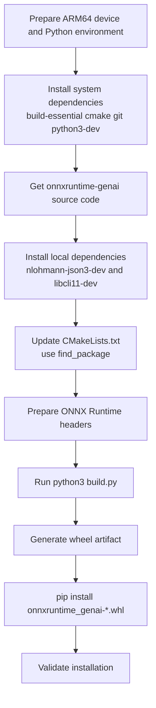

## 1. Overview

onnxruntime-genai is Microsoft's official high-performance inference library designed for generative AI models. It extends ONNX Runtime and is optimized for LLMs, VLMs, and speech models such as Whisper.

The library provides bindings for Python, C++, C#, and Java, making it easy to integrate into different tech stacks.

At the moment, official PyPI wheels are prioritized for:

- Windows: win_amd64, win_arm64
- macOS: arm64
- Linux (manylinux): x86_64

For Linux ARM64, support is usually provided by the community or commercial partners. This article focuses on a practical wheel build workflow for users on Linux ARM64 devices such as Jetson and Raspberry Pi.

> This guide is intended for users who need to build and install onnxruntime-genai locally on ARM64 devices.
{: .prompt-info }

## Build Workflow Diagram



> If network-related errors occur during the build, check Section 5 and Section 6 first.
{: .prompt-tip }

## 2. Software and Hardware Environment

- Hardware: Raspberry Pi 4B/5, NVIDIA Jetson series
- OS: Raspberry Pi OS (64-bit) / Ubuntu 20.04, 22.04, 24.04 (ARM64)
- Python: 3.11+

For older devices such as Jetson NX, where the default Python version may be too old, use Miniconda (or similar) to create a compatible virtual environment.

## 3. Install System Dependencies

Install build dependencies in two steps:

1. Refresh package index
2. Install the build toolchain

```bash
sudo apt update
sudo apt install -y build-essential cmake git python3-dev
```

Notes:

- build-essential: core compiler toolchain
- cmake: build system generator
- git: version control tool
- python3-dev: Python development headers and libraries

## 4. Clone and Extract Source Code

### 4.1 If network access is stable, clone directly

```bash
git clone https://github.com/microsoft/onnxruntime-genai.git
cd onnxruntime-genai
```

### 4.2 If network is unstable, transfer source archive offline

- Download the source archive in advance
- Transfer it to Raspberry Pi / Jetson via USB drive or WinSCP
- Extract and enter the source directory on the target device

## 5. Handle Network Issues for Dependencies

The build requires nlohmann/json and CLI11. If GitHub connectivity is unstable, pre-install these dependencies via system packages.

### 5.1 Recommended: install via apt

```bash
sudo apt install -y nlohmann-json3-dev
sudo apt install -y libcli11-dev
```

Verify after installation:

```bash
ls /usr/include/nlohmann/   # expected: json.hpp
ls /usr/include/CLI/        # expected: CLI.hpp
```

### 5.2 Alternative: download headers manually

- nlohmann/json:
  <https://raw.githubusercontent.com/nlohmann/json/develop/single_include/nlohmann/json.hpp>
- CLI11:
  <https://raw.githubusercontent.com/CLIUtils/CLI11/main/include/CLI/CLI.hpp>

> If you installed via apt, prefer system-resolved libraries in CMake to avoid redundant remote fetches.
{: .prompt-tip }

## 6. Update CMake Configuration

After dependencies are installed, update the project CMake settings so the build uses local packages instead of downloading from GitHub.

Target file: examples/c/CMakeLists.txt

### 6.1 nlohmann_json

Replace remote fetch logic:

```cmake
include(FetchContent)
FetchContent_Declare(
  nlohmann_json
  GIT_REPOSITORY https://github.com/nlohmann/json.git
  GIT_TAG v3.12.0
)
FetchContent_MakeAvailable(nlohmann_json)
```

With:

```cmake
find_package(nlohmann_json REQUIRED)
```

### 6.2 CLI11

Replace remote fetch logic:

```cmake
FetchContent_Declare(
  CLI11
  GIT_REPOSITORY https://github.com/CLIUtils/CLI11.git
  GIT_TAG v2.6.1
)
FetchContent_MakeAvailable(CLI11)
```

With:

```cmake
find_package(CLI11 REQUIRED)
```

## 7. Prepare ONNX Runtime Header Dependencies

The build also requires ONNX Runtime core headers. If they are missing, download and provide the following files manually:

- <https://raw.githubusercontent.com/microsoft/onnxruntime/main/include/onnxruntime/core/session/onnxruntime_c_api.h>
- <https://raw.githubusercontent.com/microsoft/onnxruntime/main/include/onnxruntime/core/session/onnxruntime_cxx_api.h>
- <https://raw.githubusercontent.com/microsoft/onnxruntime/main/include/onnxruntime/core/session/onnxruntime_cxx_inline.h>
- <https://raw.githubusercontent.com/microsoft/onnxruntime/main/include/onnxruntime/core/session/onnxruntime_ep_c_api.h>
- <https://raw.githubusercontent.com/microsoft/onnxruntime/main/include/onnxruntime/core/session/onnxruntime_float16.h>
- <https://raw.githubusercontent.com/microsoft/onnxruntime/main/include/onnxruntime/core/session/onnxruntime_session_options_config_keys.h>

> Header names can vary across ONNX Runtime versions. Always align with the include directory of your target version.
{: .prompt-warning }

## 8. Build

In the onnxruntime-genai source directory, run:

```bash
python3 build.py
```

If successful, wheel artifacts are typically generated under:

```text
build/Linux/RelWithDebInfo/wheel/
```

Example filename:

```text
onnxruntime_genai-0.14.0.dev0-cp313-cp313-linux_aarch64.whl
```

## 9. Install the Built Wheel

Inside the wheel output directory, run:

```bash
pip install onnxruntime_genai-*.whl
```

Then verify:

```bash
pip list | grep onnxruntime-genai
```

## 10. Common Issues and Fixes

### Q1: fatal error: onnxruntime_cxx_api.h: No such file or directory

Cause: Missing ONNX Runtime core headers.

Fix: Refer to Section 7 and manually download/place required headers.

### Q2: fatal error: onnxruntime_c_ep_api.h: No such file or directory

Cause: The header chain depends on newer EP API headers.

Fix: Refer to Section 7, add onnxruntime_ep_c_api.h (or the version-specific equivalent), and ensure it is visible in your include path.

### Q3: GnuTLS recv error (-110)

Cause: Unstable GitHub network connection causes dependency fetch failures.

Fix: Refer to Section 5. Install dependencies through apt and update CMake to use find_package so the build does not depend on network fetches.

---

## Summary

For Linux ARM64, the two most important points when building onnxruntime-genai wheels are:

1. Resolve dependencies locally with find_package whenever possible.
2. Prepare ONNX Runtime headers in advance to avoid build interruptions.

These steps can significantly improve build stability and success rate on Jetson and Raspberry Pi devices.
