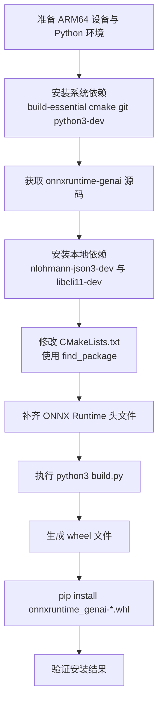

## 1. 概述

onnxruntime-genai 是微软官方推出的、面向生成式 AI 模型的高性能推理库。它是 ONNX Runtime 的扩展，专门用于优化大语言模型（LLM）、视觉语言模型（VLM）和语音模型（如 Whisper）等生成式模型的运行效率。

该库提供 Python、C++、C#、Java 等多语言接口，便于集成到不同技术栈。

目前，官方在 PyPI 上优先提供以下平台的 wheel 包：

- Windows：win_amd64、win_arm64
- macOS：arm64
- Linux（manylinux）：x86_64

对于 Linux ARM64，通常需要社区或商业合作方提供构建支持。本文目标就是给 Jetson、Raspberry Pi 等 Linux ARM64 设备用户提供一套可落地的 wheel 包构建方案。

> 本文适用于需要在 ARM64 设备本地编译并安装 onnxruntime-genai 的场景。
{: .prompt-info }

## 构建流程图



> 若构建过程出现网络相关错误，优先回到第 5 节与第 6 节检查依赖安装与 CMake 配置。
{: .prompt-tip }

## 2. 软硬件环境

- 硬件设备：Raspberry Pi 4B/5，NVIDIA Jetson 系列开发板
- 操作系统：Raspberry Pi OS (64-bit) / Ubuntu 20.04、22.04、24.04（ARM64）
- Python 版本：3.11 及以上

对于 Jetson NX 等较早设备，如果系统默认 Python 版本偏低，建议使用 Miniconda 等工具创建独立虚拟环境。

## 3. 安装系统依赖

安装编译依赖分两步：

1. 刷新软件源索引
2. 安装构建工具链

```bash
sudo apt update
sudo apt install -y build-essential cmake git python3-dev
```

说明：

- build-essential：核心编译套件
- cmake：构建工具
- git：版本管理工具
- python3-dev：Python 开发头文件与库

## 4. 克隆并解压源码

### 4.1 网络正常时，直接克隆

```bash
git clone https://github.com/microsoft/onnxruntime-genai.git
cd onnxruntime-genai
```

### 4.2 网络不稳定时，离线传输

- 提前下载源码压缩包
- 通过 U 盘或 WinSCP 传到 Raspberry Pi / Jetson
- 在设备上解压并进入目录

## 5. 处理依赖库网络问题

编译过程需要 nlohmann/json 与 CLI11。若设备访问 GitHub 不稳定，建议提前通过系统包安装。

### 5.1 推荐方案：apt 全局安装

```bash
sudo apt install -y nlohmann-json3-dev
sudo apt install -y libcli11-dev
```

安装后验证：

```bash
ls /usr/include/nlohmann/   # 预期包含 json.hpp
ls /usr/include/CLI/        # 预期包含 CLI.hpp
```

### 5.2 备选方案：手动下载头文件

- nlohmann/json：
  <https://raw.githubusercontent.com/nlohmann/json/develop/single_include/nlohmann/json.hpp>
- CLI11：
  <https://raw.githubusercontent.com/CLIUtils/CLI11/main/include/CLI/CLI.hpp>

> 如果你使用了 apt 安装，优先让 CMake 走系统库，避免重复拉取远程依赖。
{: .prompt-tip }

## 6. 修改 CMake 配置文件

安装完依赖后，建议修改 onnxruntime-genai 项目中的 CMake 配置，避免在构建时从 GitHub 拉取依赖。

目标文件：examples/c/CMakeLists.txt

### 6.1 nlohmann_json

将远程拉取逻辑：

```cmake
include(FetchContent)
FetchContent_Declare(
  nlohmann_json
  GIT_REPOSITORY https://github.com/nlohmann/json.git
  GIT_TAG v3.12.0
)
FetchContent_MakeAvailable(nlohmann_json)
```

替换为：

```cmake
find_package(nlohmann_json REQUIRED)
```

### 6.2 CLI11

将远程拉取逻辑：

```cmake
FetchContent_Declare(
  CLI11
  GIT_REPOSITORY https://github.com/CLIUtils/CLI11.git
  GIT_TAG v2.6.1
)
FetchContent_MakeAvailable(CLI11)
```

替换为：

```cmake
find_package(CLI11 REQUIRED)
```

## 7. 处理 ONNX Runtime 头文件依赖

编译过程中还需要 ONNX Runtime 核心头文件。若构建环境缺失，请手动补齐以下文件：

- <https://raw.githubusercontent.com/microsoft/onnxruntime/main/include/onnxruntime/core/session/onnxruntime_c_api.h>
- <https://raw.githubusercontent.com/microsoft/onnxruntime/main/include/onnxruntime/core/session/onnxruntime_cxx_api.h>
- <https://raw.githubusercontent.com/microsoft/onnxruntime/main/include/onnxruntime/core/session/onnxruntime_cxx_inline.h>
- <https://raw.githubusercontent.com/microsoft/onnxruntime/main/include/onnxruntime/core/session/onnxruntime_ep_c_api.h>
- <https://raw.githubusercontent.com/microsoft/onnxruntime/main/include/onnxruntime/core/session/onnxruntime_float16.h>
- <https://raw.githubusercontent.com/microsoft/onnxruntime/main/include/onnxruntime/core/session/onnxruntime_session_options_config_keys.h>

> 不同 ONNX Runtime 版本的头文件命名可能略有差异，建议以当前使用版本的 include 目录为准。
{: .prompt-warning }

## 8. 执行编译

在 onnxruntime-genai 源码目录执行：

```bash
python3 build.py
```

构建成功后，wheel 文件通常位于：

```text
build/Linux/RelWithDebInfo/wheel/
```

示例文件名：

```text
onnxruntime_genai-0.14.0.dev0-cp313-cp313-linux_aarch64.whl
```

## 9. 安装编译好的 Wheel

进入 wheel 输出目录后执行：

```bash
pip install onnxruntime_genai-*.whl
```

安装完成后验证：

```bash
pip list | grep onnxruntime-genai
```

## 10. 常见问题与解决方案

### Q1: fatal error: onnxruntime_cxx_api.h: No such file or directory

原因：缺少 ONNX Runtime 核心头文件。

解决：参考第 7 节，手动下载并放置相关头文件。

### Q2: fatal error: onnxruntime_c_ep_api.h: No such file or directory

原因：当前头文件链路依赖较新的 EP API 头文件。

解决：参考第 7 节，补齐 `onnxruntime_ep_c_api.h`（或对应版本命名）并确保在同一 include 路径下可见。

### Q3: GnuTLS recv error (-110)

原因：GitHub 网络连接不稳定导致依赖拉取失败。

解决：参考第 5 节，使用系统包安装依赖并在 CMake 中改为 `find_package`，避免构建期联网下载。

---

## 直接下载已编译 Wheel（免编译）

如果你不希望自己编译，可以直接下载我提供的 ARM64 Wheel 包：

- [onnxruntime_genai-0.14.0.dev0-cp313-cp313-linux_aarch64.whl](/assets/downloads/onnxruntime_genai-0.14.0.dev0-cp313-cp313-linux_aarch64.whl)

安装方式（本地文件）：

```bash
pip install ./onnxruntime_genai-0.14.0.dev0-cp313-cp313-linux_aarch64.whl
```

安装方式（在线 URL）：

```bash
pip install "https://shijiong.github.io/assets/downloads/onnxruntime_genai-0.14.0.dev0-cp313-cp313-linux_aarch64.whl"
```

> 请确保 Python 版本与 wheel 标签一致（该包为 CPython 3.13，aarch64）。
{: .prompt-warning }

## 小结

在 Linux ARM64 平台上构建 onnxruntime-genai wheel 的关键点是两件事：

1. 尽量将依赖改为系统本地可解析（`find_package`）
2. 提前补齐 ONNX Runtime 相关头文件，减少构建中断

这样可以显著提升在 Jetson、Raspberry Pi 等设备上的构建稳定性与成功率。